# 项目方法级 UML 关系图

本文档基于当前仓库 `src/main/java/com/kotva` 的实际代码整理，目标是把主链路画到“方法级”。

说明：
- 这里优先覆盖真正驱动项目运行的主链路，而不是把全部 192 个 Java 文件都塞进一张无法阅读的大图。
- 图中会同时标出：
  - 类的所属层与职责
  - 方法之间的调用关系
  - 方法之间传输的数据对象
  - 关键拥有关系（owns / creates / reads / returns）

---

## 1. 分层与所有权总图

```mermaid
classDiagram
direction LR

class AppContext {
  +AppContext()
  +ClockService getClockService()
  +SettlementService getSettlementService()
  +DictionaryRepository getDictionaryRepository()
  +SettingsRepository getSettingsRepository()
  +GameRuntimeFactory getGameRuntimeFactory()
}

class SceneNavigator {
  -AppContext appContext
  -GameLaunchContext gameLaunchContext
  -GameController gameController
  +getAppContext() AppContext
  +showHome()
  +showGame(GameLaunchContext)
  +goBack()
  -showPage(PageType, boolean)
  -showGameScene()
  -releaseCurrentPage()
}

class GameScene {
  +GameScene(GameController)
  -createRoot(GameController) Parent
  -loadStyleSheets()
}

class GameController {
  -GameRuntimeFactory gameRuntimeFactory
  -GameLaunchContext launchContext
  -GameViewModel viewModel
  -GameDraftState draftState
  -GameRuntime gameRuntime
  -GameRenderer renderer
  +getViewModel() GameViewModel
  +getDraftState() GameDraftState
  +getSession() GameSession
  +hasSession() boolean
  +refreshFromCurrentSession()
  +bind(GameRenderer, GameInteractionCoordinator)
  -startGameFromLaunchContext()
  -pollSnapshot()
  -renderSnapshot(GameSessionSnapshot)
  -buildPlayerCards(GameSessionSnapshot) List~PlayerCardModel~
  -buildRackTiles(GameSessionSnapshot) List~TileModel~
  -buildBoardTiles(GameSessionSnapshot) List~BoardTileModel~
  -resolveTotalTimerText(GameSessionSnapshot) String
  -resolveStepTimerText(GameSessionSnapshot) String
  -formatDuration(long) String
  -stopPolling()
  +shutdown()
  -refreshSnapshotAfterAction()
  -tickClockBeforeActionIfNeeded()
  -shutdownRuntime()
  -syncAiTurn(GameSessionSnapshot)
  -handleAiMoveCompleted(TurnCompletion)
  +isInteractionLocked() boolean
  +onDraftTilePlaced(String, Position)
  +onDraftTileMoved(String, Position)
  +onDraftTileRemoved(String)
  +onRecallAllDraftTilesRequested()
  +onSubmitDraftRequested()
  +onSkipTurnRequested()
  +onRearrangeRequested()
  +onResignRequested()
}

class GameInteractionCoordinator {
  -BoardView boardView
  -RackView rackView
  -ActionPanelView actionPanelView
  -GameDraftState draftState
  -PreviewRenderer previewRenderer
  -GameRenderer gameRenderer
  -GameActionPort actionPort
  +attach()
  -bindRackInteractions()
  -bindBoardInteractions()
  -bindWorkbenchButtons()
  -handleRackPressed(int, MouseEvent)
  -handleBoardPressed(BoardCoordinate, MouseEvent)
  -handleSceneMouseDragged(MouseEvent)
  -handleSceneMouseReleased(MouseEvent)
  -recallAllDraftTiles()
  -submitDraft()
}

class GameRenderer {
  -BoardRenderer boardRenderer
  -RackRenderer rackRenderer
  -GameViewModel lastViewModel
  +render(GameViewModel)
  +refresh()
  -applyRender(GameViewModel)
}

class GameRuntimeFactory {
  -GameSetupService gameSetupService
  -GameApplicationService gameApplicationService
  +create(NewGameRequest) GameRuntime
}

class GameRuntime {
  <<interface>>
  +start(NewGameRequest)
  +hasSession() boolean
  +getSession() GameSession
  +hasTimeControl() boolean
  +isSessionInProgress() boolean
  +getSessionSnapshot() GameSessionSnapshot
  +tickClock(long) GameSessionSnapshot
  +placeDraftTile(String, Position)
  +moveDraftTile(String, Position)
  +removeDraftTile(String)
  +recallAllDraftTiles()
  +submitDraft()
  +passTurn()
  +shutdown()
}

class AbstractLocalGameRuntime {
  -GameSetupService gameSetupService
  #GameApplicationService gameApplicationService
  -GameSession session
  +start(NewGameRequest)
  +getSessionSnapshot() GameSessionSnapshot
  +tickClock(long) GameSessionSnapshot
  +placeDraftTile(String, Position)
  +moveDraftTile(String, Position)
  +removeDraftTile(String)
  +recallAllDraftTiles()
  +submitDraft()
  +passTurn()
  +shutdown()
  #afterSessionStarted()
  #decorateSnapshot(GameSessionSnapshot) GameSessionSnapshot
}

class LocalAiGameRuntime {
  -AiTurnRuntime aiTurnRuntime
  -AiRuntimeSnapshot aiRuntimeSnapshot
  +hasAutomatedTurnSupport() boolean
  +isCurrentTurnAutomated() boolean
  +requestAutomatedTurnIfIdle(Consumer)
  +matchesAutomatedTurn(TurnCompletion) boolean
  +applyAutomatedTurn(TurnCompletion)
  +disableAutomatedTurnSupport()
  +shutdown()
  #afterSessionStarted()
  #decorateSnapshot(GameSessionSnapshot) GameSessionSnapshot
}

class GameSetupServiceImpl {
  -DictionaryRepository dictionaryRepository
  -ClockService clockService
  -Random random
  +buildConfig(NewGameRequest) GameConfig
  +startNewGame(NewGameRequest) GameSession
  -createSession(GameConfig) GameSession
  -createPlayers(GameConfig) List~Player~
  -createPlayerClock(TimeControlConfig) PlayerClock
  -normalizePlayerName(String) String
  -resolvePlayerType(GameMode, int) PlayerType
}

class GameApplicationServiceImpl {
  -ClockService clockService
  -DraftManager draftManager
  -MovePreviewService movePreviewService
  -DictionaryRepository dictionaryRepository
  +assignLettertoBlank(GameSession, String, char)
  +placeDraftTile(GameSession, String, Position) PreviewResult
  +moveDraftTile(GameSession, String, Position) PreviewResult
  +removeDraftTile(GameSession, String) PreviewResult
  +recallAllDraftTiles(GameSession) PreviewResult
  +submitDraft(GameSession) SubmitDraftResult
  +passTurn(GameSession) TurnTransitionResult
  +tickClock(GameSession, long) GameSessionSnapshot
  +getSessionSnapshot(GameSession) GameSessionSnapshot
  -refreshPreview(GameSession) PreviewResult
  -executeAction(GameSession, PlayerAction) ActionDispatchResult
  -executePlace(GameSession, Player, PlayerAction) ActionDispatchResult
  -executePass(GameSession, Player, PlayerAction) ActionDispatchResult
  -executeLose(GameSession, Player, PlayerAction) ActionDispatchResult
}

class GameSession {
  -String sessionId
  -GameConfig config
  -GameState gameState
  -TurnDraft turnDraft
  -SessionStatus sessionStatus
  -TurnCoordinator turnCoordinator
  +getSessionId() String
  +getConfig() GameConfig
  +getGameState() GameState
  +getTurnDraft() TurnDraft
  +resetTurnDraft()
  +getSessionStatus() SessionStatus
  +setSessionStatus(SessionStatus)
  +getTurnCoordinator() TurnCoordinator
}

class GameSessionSnapshotFactory {
  +fromSession(GameSession) GameSessionSnapshot
  +fromSession(GameSession, AiRuntimeSnapshot) GameSessionSnapshot
  -buildCurrentRackTiles(Player) List~RackTileSnapshot~
  -buildBoardCells(GameSession, Player, PreviewSnapshot) List~BoardCellRenderSnapshot~
  -buildDraftPlacements(GameSession) List~DraftPlacementSnapshot~
  -buildPreviewSnapshot(GameSession) PreviewSnapshot
}

class RuleEngine {
  -DictionaryRepository dictionaryRepository
  +validateMove(GameState, PlayerAction) String
  +apply(GameState, PlayerAction)
}

AppContext --> GameRuntimeFactory : owns
SceneNavigator --> AppContext : reads
SceneNavigator --> GameController : creates / releases
GameScene --> GameController : binds
GameController --> GameRuntimeFactory : create()
GameController --> GameRuntime : owns current runtime
GameController --> GameRenderer : owns
GameController --> GameDraftState : owns
GameInteractionCoordinator --> GameActionPort : dispatches UI action
GameRenderer --> GameDraftState : reads merged UI state
GameRuntimeFactory --> AbstractLocalGameRuntime : creates
AbstractLocalGameRuntime ..|> GameRuntime
LocalAiGameRuntime --|> AbstractLocalGameRuntime
AbstractLocalGameRuntime --> GameSetupServiceImpl : startNewGame()
AbstractLocalGameRuntime --> GameApplicationServiceImpl : gameplay actions
AbstractLocalGameRuntime --> GameSession : owns current session
GameSetupServiceImpl --> GameSession : creates
GameApplicationServiceImpl --> GameSession : mutates / snapshots
GameApplicationServiceImpl --> RuleEngine : validates / applies
GameApplicationServiceImpl --> GameSessionSnapshotFactory : builds snapshot
GameSession --> TurnCoordinator : owns
GameSessionSnapshotFactory --> GameSession : reads
```

---

## 2. 主链路一：启动、建局、进入游戏页

### 2.1 方法级时序图

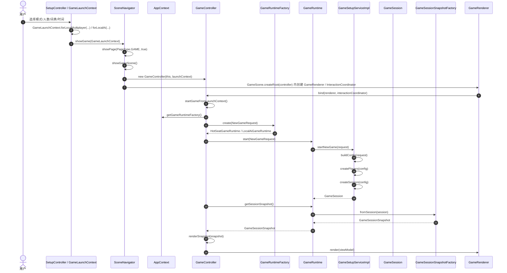

### 2.2 这一段的数据传输

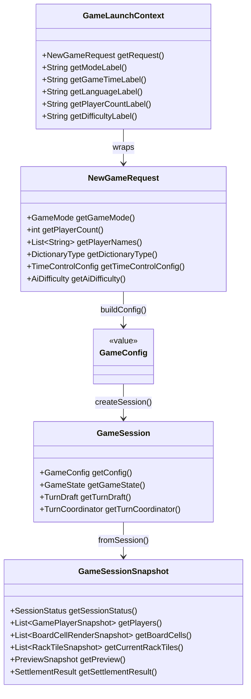

---

## 3. 主链路二：拖拽、预览、提交落子

### 3.1 类与方法关系图

```mermaid
classDiagram
direction LR

class GameActionPort {
  <<interface>>
  +isInteractionLocked() boolean
  +onDraftTilePlaced(String, Position)
  +onDraftTileMoved(String, Position)
  +onDraftTileRemoved(String)
  +onRecallAllDraftTilesRequested()
  +onSubmitDraftRequested()
  +onSkipTurnRequested()
  +onRearrangeRequested()
  +onResignRequested()
}

class GameInteractionCoordinator {
  +attach()
  -handleRackPressed(int, MouseEvent)
  -handleBoardPressed(BoardCoordinate, MouseEvent)
  -handleSceneMouseDragged(MouseEvent)
  -handleSceneMouseReleased(MouseEvent)
  -recallAllDraftTiles()
  -submitDraft()
}

class PreviewRenderer {
  +beginRackDrag(int, TileModel, double, double)
  +beginBoardDrag(BoardCoordinate, TileModel, double, double)
  +update(double, double)
  +clear()
  +hasActiveDrag() boolean
  +isDraggingFromRack() boolean
  +isDraggingFromBoard() boolean
  +getDraggedTileId() String
  +getSuppressedRackIndex() Integer
  +getSuppressedBoardCoordinate() BoardCoordinate
  +getHoveredCoordinate() BoardCoordinate
}

class GameDraftState {
  +syncSnapshot(List~TileModel~, List~BoardTileModel~)
  +getRenderedRackTiles(Integer) List~TileModel~
  +getRenderedBoardTiles(BoardCoordinate) List~BoardTileModel~
  +getRackTileAt(int) TileModel
  +getDraftTileAt(BoardCoordinate) DraftPlacementModel
  +hasDraftPlacements() boolean
  +isCellOccupied(BoardCoordinate, String) boolean
}

class GameController {
  +onDraftTilePlaced(String, Position)
  +onDraftTileMoved(String, Position)
  +onDraftTileRemoved(String)
  +onRecallAllDraftTilesRequested()
  +onSubmitDraftRequested()
  +onSkipTurnRequested()
  -tickClockBeforeActionIfNeeded()
  -refreshSnapshotAfterAction()
}

class AbstractLocalGameRuntime {
  +placeDraftTile(String, Position)
  +moveDraftTile(String, Position)
  +removeDraftTile(String)
  +recallAllDraftTiles()
  +submitDraft()
  +passTurn()
}

class PlayerController {
  +assignLettertoBlank(GameApplicationService, GameSession, String, char)
  +placeDraftTile(GameApplicationService, GameSession, String, Position) PreviewResult
  +moveDraftTile(GameApplicationService, GameSession, String, Position) PreviewResult
  +removeDraftTile(GameApplicationService, GameSession, String) PreviewResult
  +recallAllDraftTiles(GameApplicationService, GameSession) PreviewResult
  +submitDraft(GameApplicationService, GameSession) SubmitDraftResult
  +passTurn(GameApplicationService, GameSession) TurnTransitionResult
}

class GameApplicationServiceImpl {
  +assignLettertoBlank(GameSession, String, char)
  +placeDraftTile(GameSession, String, Position) PreviewResult
  +moveDraftTile(GameSession, String, Position) PreviewResult
  +removeDraftTile(GameSession, String) PreviewResult
  +recallAllDraftTiles(GameSession) PreviewResult
  +submitDraft(GameSession) SubmitDraftResult
  +passTurn(GameSession) TurnTransitionResult
  -refreshPreview(GameSession) PreviewResult
  -executeAction(GameSession, PlayerAction) ActionDispatchResult
}

class DraftManager {
  +placeTile(TurnDraft, String, Position)
  +moveTile(TurnDraft, String, Position)
  +removeTile(TurnDraft, String)
  +recallAllTiles(TurnDraft)
  +findPlacementByTileId(TurnDraft, String) DraftPlacement
}

class MovePreviewServiceImpl {
  +preview(GameSession) PreviewResult
  -validateSafely(GameState, PlayerAction) String
  -extractCandidateWords(GameState, PlayerAction) List~CandidateWord~
  -buildPreviewWords(GameState, PlayerAction, List~CandidateWord~) List~PreviewWord~
}

class TurnDraftActionMapper {
  +toPlaceAction(String, TurnDraft) PlayerAction
}

class RuleEngine {
  +validateMove(GameState, PlayerAction) String
  +apply(GameState, PlayerAction)
}

GameInteractionCoordinator --> GameActionPort : dispatches
GameInteractionCoordinator --> PreviewRenderer : drives drag preview
GameInteractionCoordinator --> GameDraftState : reads local visual state
GameController ..|> GameActionPort
GameController --> AbstractLocalGameRuntime : forwards user intent
AbstractLocalGameRuntime --> PlayerController : requireCurrentPlayerController()
PlayerController --> GameApplicationServiceImpl : delegates
GameApplicationServiceImpl --> DraftManager : edit TurnDraft
GameApplicationServiceImpl --> MovePreviewServiceImpl : recompute preview
GameApplicationServiceImpl --> TurnDraftActionMapper : draft -> action
GameApplicationServiceImpl --> RuleEngine : validate / apply
```

### 3.2 方法级时序图：从拖拽到预览

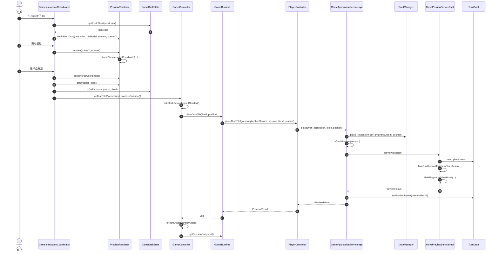

### 3.3 方法级时序图：提交落子

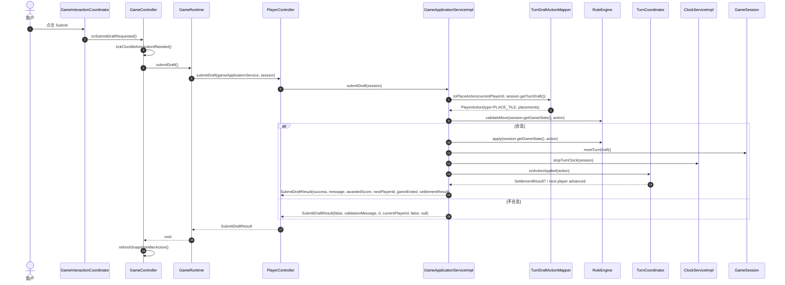

---

## 4. 主链路三：快照构造与 UI 回写

### 4.1 类图

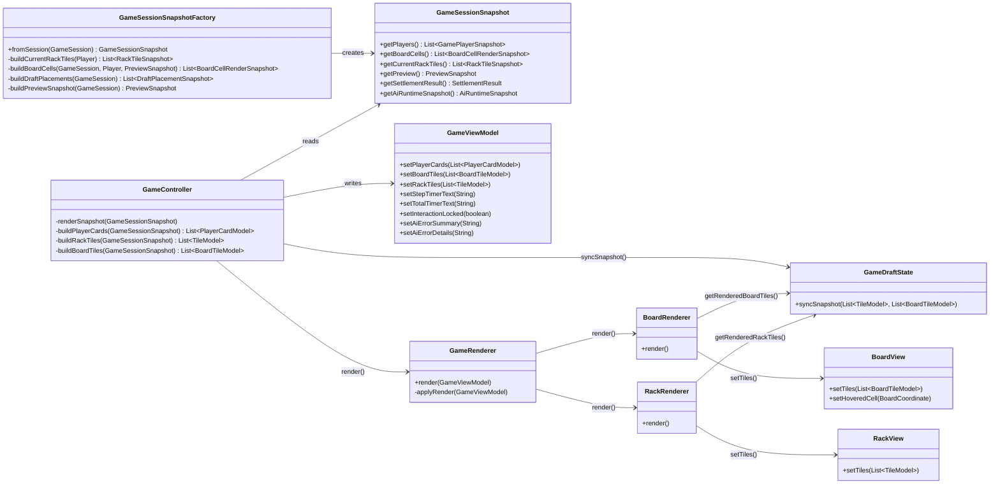

### 4.2 数据对象关系图

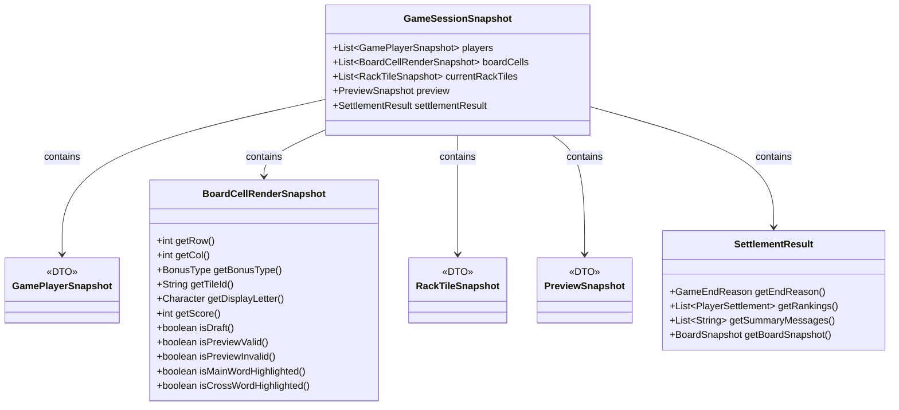

---

## 5. 主链路四：计时、回合推进、终局结算

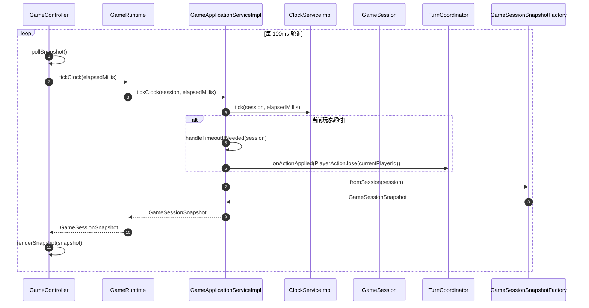

### 5.1 关键类关系

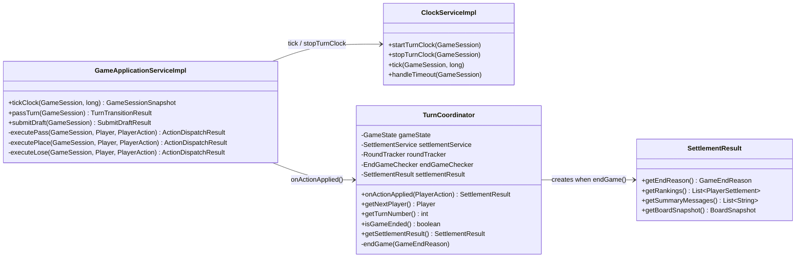

---

## 6. AI 分支链路

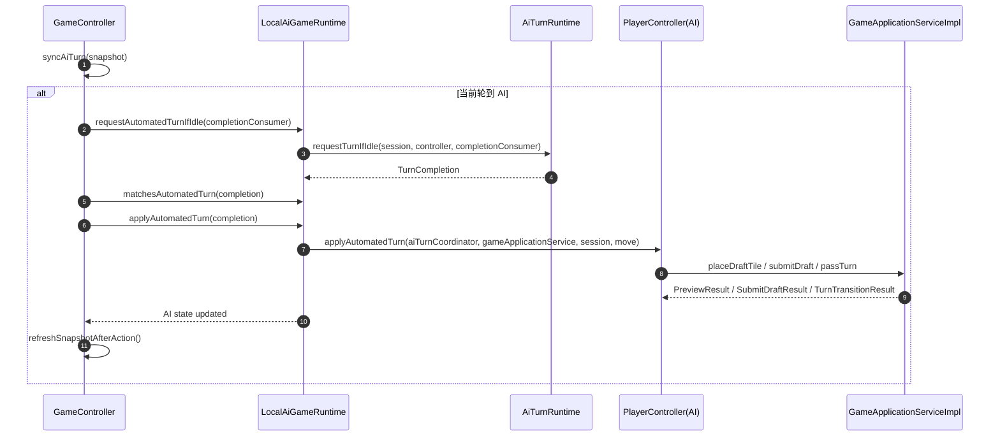

---

## 7. 类与方法职责索引

| 类 / 方法 | 所属层 | 职责 |
|---|---|---|
| `AppContext` | launcher | 装配服务与运行时工厂 |
| `SceneNavigator.showGame()` | presentation.fx | 切页，并把 `GameLaunchContext` 带入游戏页 |
| `GameController.bind()` | presentation.controller | 绑定渲染与交互，并真正启动对局 |
| `GameController.renderSnapshot()` | presentation.controller | 把 `GameSessionSnapshot` 转成 `GameViewModel` |
| `GameInteractionCoordinator.handleSceneMouseReleased()` | presentation.interaction | 决定释放时是“落到棋盘”还是“取消预览” |
| `PreviewRenderer.beginRackDrag()/beginBoardDrag()` | presentation.renderer | 创建跟手拖拽的视觉层 |
| `GameDraftState.syncSnapshot()` | presentation.interaction | 把 snapshot 投影成 UI 本地可命中的只读状态 |
| `GameRuntimeFactory.create()` | application.runtime | 按模式选择 HotSeat / LocalAi runtime |
| `AbstractLocalGameRuntime.start()` | application.runtime | 调用 `GameSetupService` 启动会话 |
| `AbstractLocalGameRuntime.placeDraftTile()` | application.runtime | 把运行时动作转交给当前玩家控制器 |
| `PlayerController.placeDraftTile()` | mode | 统一本地玩家 / AI 的动作适配入口 |
| `GameApplicationServiceImpl.placeDraftTile()` | application.service | 修改 `TurnDraft`，并刷新预览 |
| `GameApplicationServiceImpl.submitDraft()` | application.service | `TurnDraft -> PlayerAction -> RuleEngine -> TurnCoordinator` |
| `DraftManager` | application.draft | 维护本回合草稿 placements |
| `TurnDraftActionMapper.toPlaceAction()` | application.draft | 把草稿转换成正式领域动作 |
| `MovePreviewServiceImpl.preview()` | application.service | 生成合法性、分数、主词/副词、高亮和消息 |
| `RuleEngine.validateMove()` | domain | 校验一手棋是否合法 |
| `RuleEngine.apply()` | domain | 把合法动作真正写回 `GameState` |
| `ClockServiceImpl.tick()` | application.service | 推进主时间 / 读秒，并在超时时标记 TIMEOUT |
| `TurnCoordinator.onActionApplied()` | application | 推进轮次、换手、判定终局、生成结算 |
| `GameSessionSnapshotFactory.fromSession()` | application.session | 把可变会话压平成 UI 只读快照 |
| `GameRenderer.applyRender()` | presentation.renderer | 把 `GameViewModel` 回写到 `BoardView/RackView/PlayerCard` |

---

## 8. 读图顺序建议

1. 先看“分层与所有权总图”，理解谁拥有谁。
2. 再看“主链路一”，理解建局是怎么进入 `GameSession` 的。
3. 然后看“主链路二”，这是交互最密集、最容易出 bug 的地方。
4. 接着看“主链路三”，理解为什么 UI 不直接读 `GameState`。
5. 最后看“主链路四”和“AI 分支链路”，理解计时、终局、AI 的特殊状态推进。

---

## 9. 文档边界

本文档当前精确覆盖的是“项目主运行链路”的方法级关系，已经足够支撑你排查大多数问题，例如：
- 拖拽为什么没有回 rack
- preview 为什么没有显示
- submit 为什么没有错误提示
- bonus 为什么没渲染
- 计时为什么在 skip/终局后异常

如果你还要，我下一步可以继续补两份更细的文件：
- `docs/uml-presentation-only.md`
  只画 `presentation.*`，适合前端同学
- `docs/uml-domain-rules.md`
  只画 `RuleEngine / MoveValidator / WordExtractor / ScoreCalculator / TurnCoordinator`
